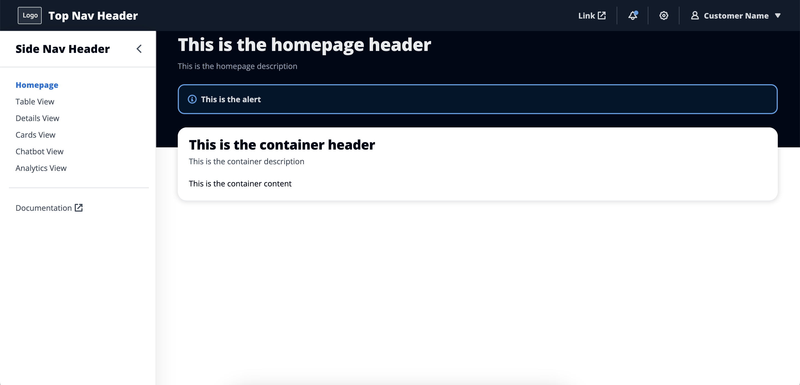
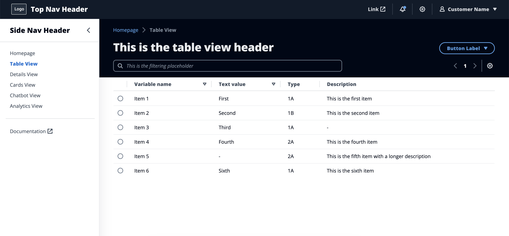
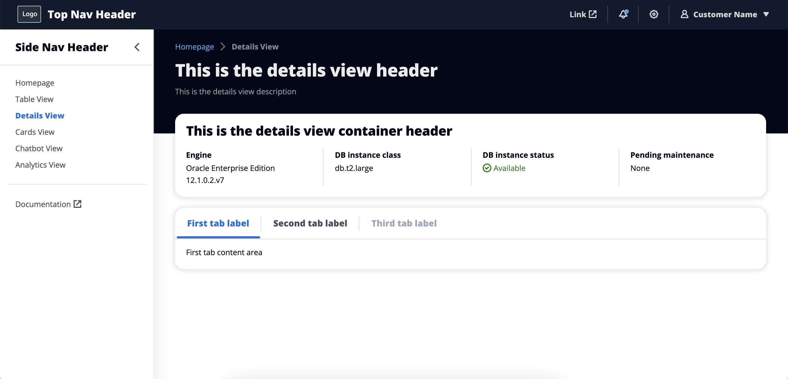
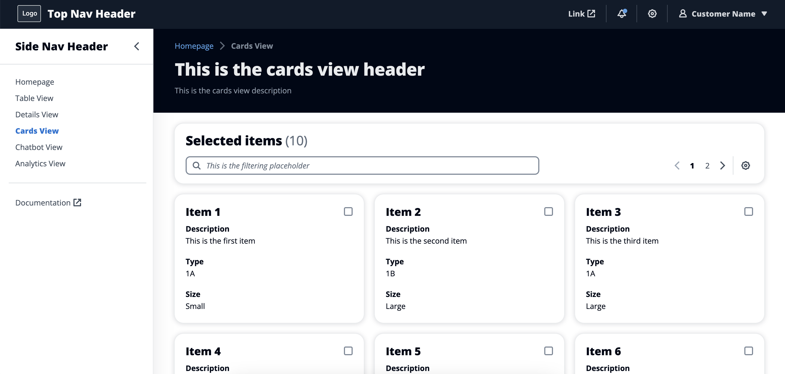
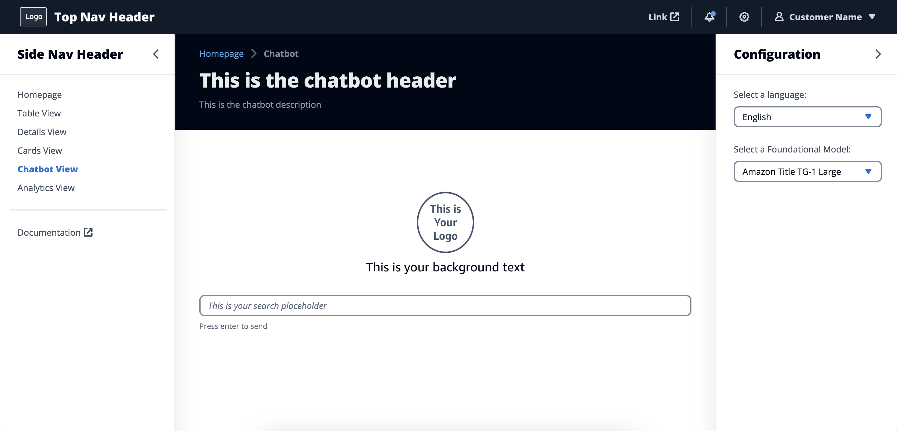
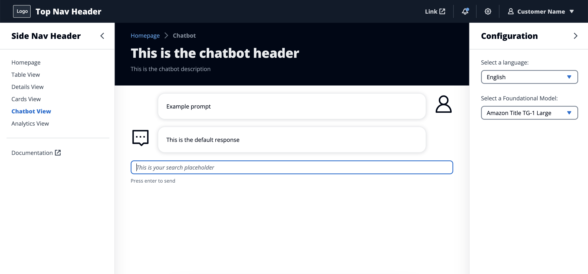
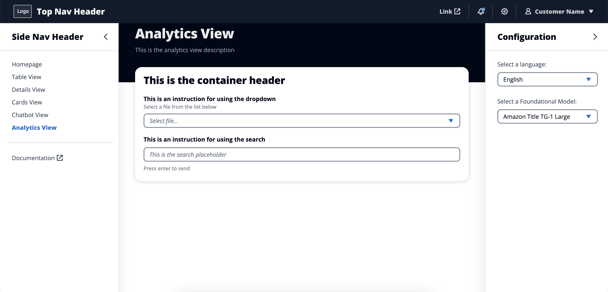
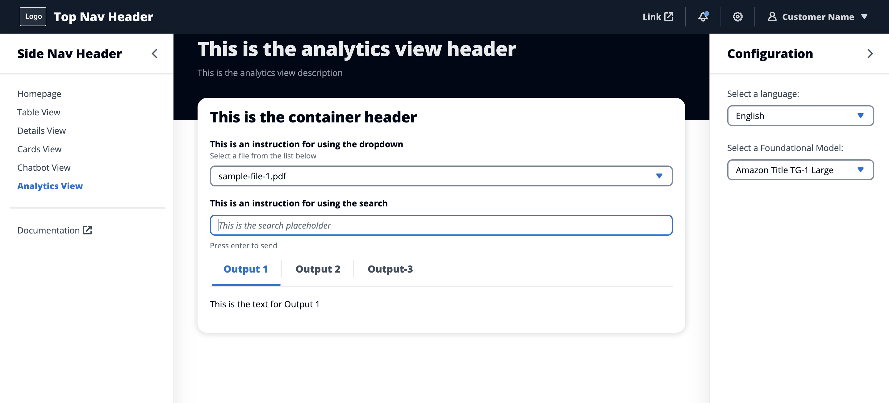

# WebUI Starter Kit

WebUI Starter Kit is a build asset for AWS Solution Building Enablement (SBE). It provides modular templates with low-code, configurable files for building web applications connected to AWS services. It is a self-service tool intended to reduce development effort for partners and accelerate completion of the Design & Build Phase of SBE.

## How it works

WebUI Starter Kit leverages the Cloudscape Design System to generate pre-built, configurable templates for React web applications. The Starter Kit includes six page types (Homepage, Table View, Details View, Cards View, Chatbot View, and Analytics View) which users can then update and configure for their own use case. For each page, the Starter Kit includes an index file and a configuration file. The configuration file enables users with limited development experience to update static data (e.g., headers) and define API calls for sending and receiving dynamic application data (e.g., database query results). Because the templates are modular, users can include or omit page types according to the needs of the particular application.

Starter Kit's ready-made web applications provide clean and consistent branding across SBE solutions, and give clear, prescriptive guidance on how to start developing and delivering product-centric solutions to customers. Because each configuration file defines a clear set of parameters for customization, the templates are accessible for teams with varying levels of technical depth and require minimal time for onboarding and enablement.

## Getting started
Clone this repository, install dependencies (`node_modules`), and start the application <br>
`gh repo clone aws-samples/webui-starter-kit` <br>
`npm i` <br>
`npm start` <br>
App should be running on http://localhost:3000/

> Note that you must have Node and npm installed in order to run this application

## User flow

**1. User clones repository and runs the application (see "Getting Started"):**
- Homepage
- Table View
- Details View
- Cards View
- Chatbot View
- Analytics View

**2. Template includes a folder for each page (e.g., `Homepage`), each of which contains two files:**
- `Homepage.jsx` – contains layout and components for the page
- `homepage-config.jsx` – contains customizable configuration for `Homepage.jsx`

**3. User updates `homepage-config.jsx` with:**
- Static data (labels, headers, etc.)
```
export const pageHeader = "This is the new homepage header"
```
- Props and attributes (select options, links, etc.)

```
export const PRICE_CLASS_OPTIONS = [

  { label: 'Use all locations', value: '0' },

  { label: 'Use only US, Canada, and Europe', value: '1' },

  { label: 'Use only US, Canada, Europe, and Asia', value: '2' }

];
```
- Dynamic data pulled via APIs

**4. User implements additional customizations as needed**

## Sample pages
### Homepage



### Table View



### Details View



### Cards View



### Chatbot View




### Analytics View




For Analytics view, use {responseData} for the Lambda response in content of tabs of <Tabs>

For Chatbot, replace "This is the default response" with		{showResponseContainer && <ResponseContainer promptResponse={responseData}></ResponseContainer>}
